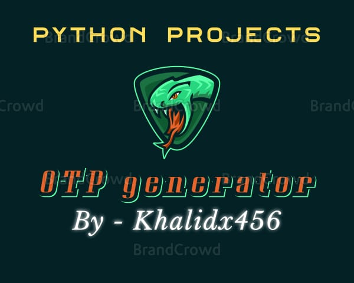

<h1 align="center"> Hi 👋, I'm Khalid Saifullah</h1> 

<h3 align="center">A passionate frontend developer from India. I am from bihar</h3>

  

  <h2>
    Termux Installation 
  </h2>
  1. pkg install python  
  2. pkg install git  
  3. git clone https://github.com/khalidx456/OTP-generator 
  4. cd OTP-generator  
  5. chmod +x OTP-generator.py  
  6. python OTP-generator.py

