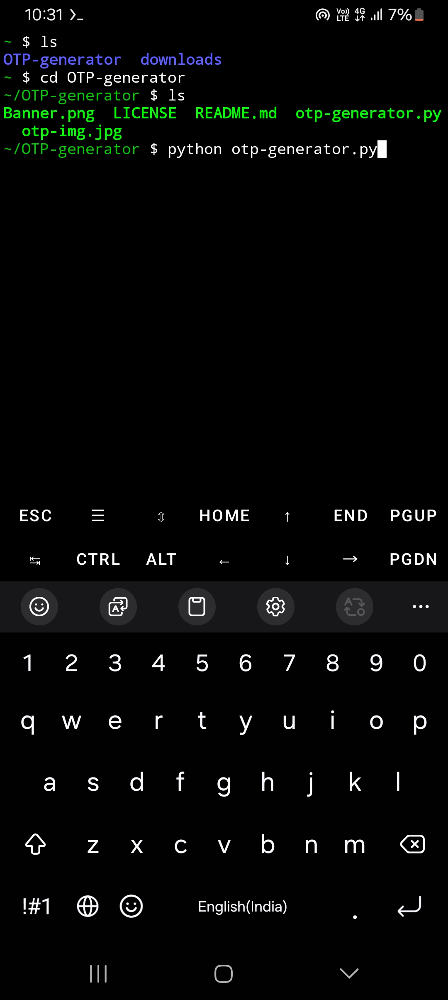
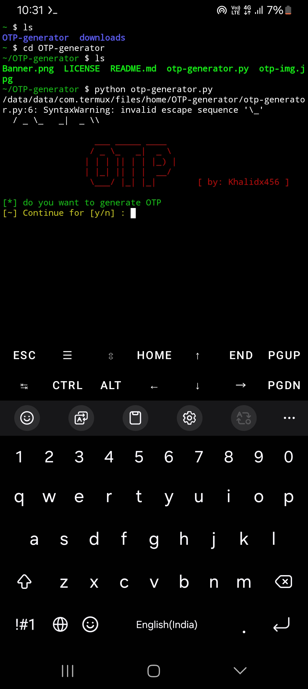
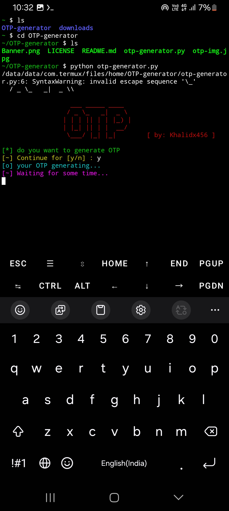
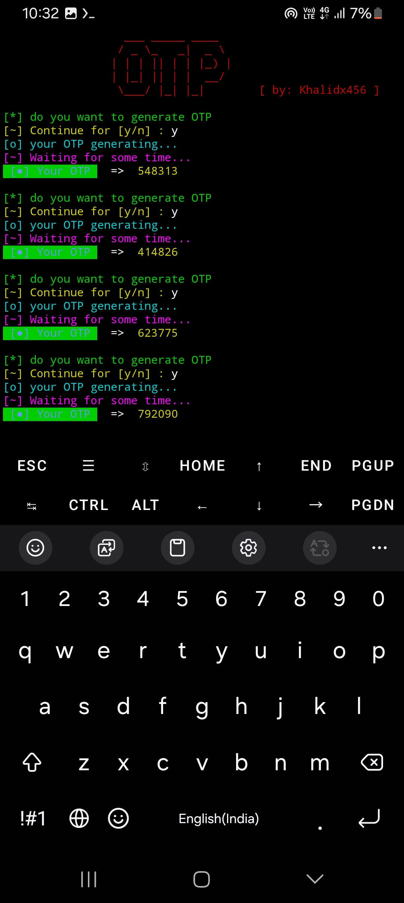

<h1 align="center"> Hi 👋, I'm Khalid Saifullah</h1> 

<h3 align="center">A passionate frontend developer from India. I am from bihar</h3>

  

  <h2>
    Termux Installation 
  </h2>
  1. pkg install python  
  2. pkg install git  
  3. git clone https://github.com/khalidx456/OTP-generator 
  4. cd OTP-generator  
  5. chmod +x OTP-generator.py  
  6. python OTP-generator.py

  <h2>Run Time</h2>
  
  
  
  

- 📝 I was build Web related from coaching [https://ajmatsirclasses.blogspot.com/](https://ajmatsirclasses.blogspot.com/)

- 💬 Ask me about **So I want to build big python projects**

- 📫 How to reach me **mrkhalid37654@gmail.com**

- 📄 Know about my experiences
 (I have No experience about python programming. But I will learn complete python programming after entrance exam of 11th AMU collage)

- ⚡ Fun fact **According to me, we should always be happy. Happiness is very important to health ✨️**
